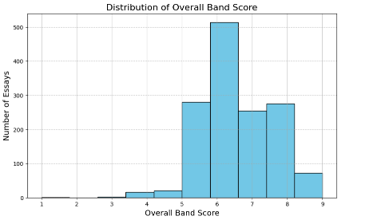
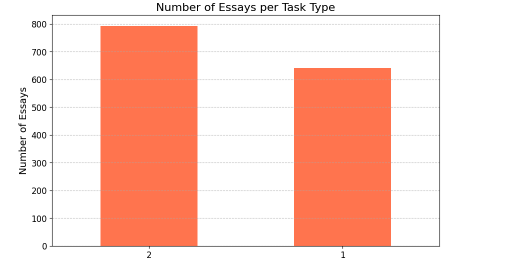
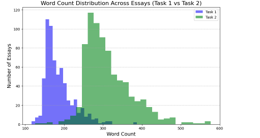
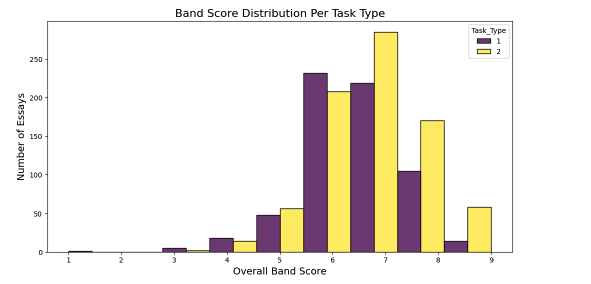

# IELTS Writing Corpus Creation and Analysis

This project demonstrates a Python-based workflow for creating, cleaning, organizing, and analyzing a corpus of IELTS writing essays.

The project was originally developed as a technical research task for a **Postdoctoral Research Associate position** and focuses on preparing learner writing data for corpus-based analysis.

## Project Overview

The workflow uses Python to transform an IELTS writing dataset into an organized text corpus while preserving relevant metadata and examining important data-quality issues.

The project includes:

- Corpus creation from a CSV dataset
- Text cleaning and preprocessing
- Essay word-count calculation
- Metadata integration
- Organization of essays by IELTS task type
- Duplicate essay detection
- Missing-data analysis
- Exploratory data analysis
- Visualization of band scores, task types, and essay lengths

## Tools & Technologies

- Python
- pandas
- Matplotlib
- Seaborn
- Regular expressions (Regex)
- Google Colab
- Corpus linguistic methods

## Data Quality & Corpus Preparation

The analysis identified several issues requiring attention during corpus preparation, including duplicate essays and missing metadata.

A total of **161 duplicate essays** were identified. Duplicate texts were systematically marked during corpus creation rather than silently removed.

Spelling and grammatical errors in the learner essays were intentionally preserved to maintain the authenticity of the original learner language.

## Visualizations

Exploratory visualizations were created to examine corpus composition, score distributions, and differences in essay length across IELTS writing task types.

### Overall Band Score Distribution

The distribution shows the range and frequency of overall band scores represented in the dataset.

### Essays by Task Type

The corpus contains essays from both IELTS Writing Task 1 and Task 2, allowing comparisons across task types.

### Word Count Distribution by Task Type

The task-specific distributions illustrate differences in essay length between Task 1 and Task 2 responses.

### Band Score Distribution by Task Type

This visualization compares the distribution of overall band scores across the two IELTS writing task types.

Additional visualizations are available in the [`figures`](figures/) directory.

## Repository Contents

The repository will include the cleaned and documented Python notebook used for corpus creation and analysis.

> **Data note:** The underlying IELTS essay dataset is not distributed through this repository. Users should obtain the original dataset from its authorized source.

## Author

**Fatemeh Bordbarjavidi, PhD**  
Applied Linguistics | Corpus Linguistics | AI & Language Technology | Language Education
